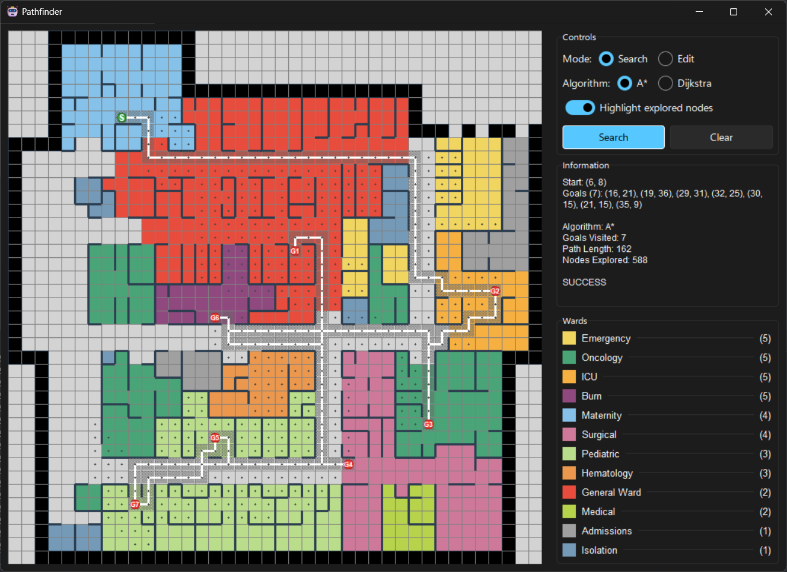
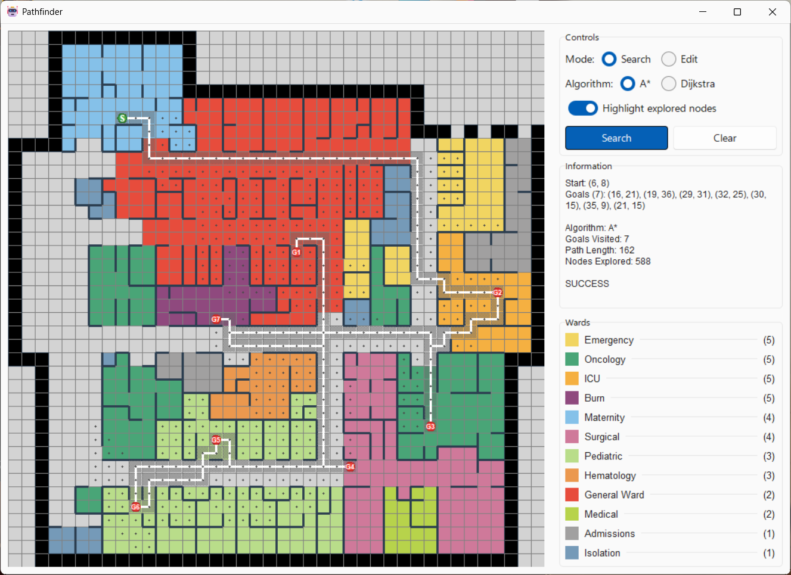

# Pathfinder

Pathfinder is a robot pathfinding application designed for hospital floor plan navigation. It utilizes algorithms like A* and Dijkstra to compute optimal paths, providing a graphical interface for visualizing and interacting with hospital floorplan.

| Dark Mode | Light Mode |
|:---------:|:----------:|
|  |  |

## Installation

### Prerequisites

- Python 3.14 or higher
- [uv](https://github.com/astral-sh/uv) (recommended for dependency management)

### Steps

1. Clone the repository:
   ```bash
   git clone https://github.com/qonTesq/Pathfinder.git
   cd Pathfinder
   ```

2. Install dependencies using uv:
   ```bash
   uv sync
   ```
   
3. (Optional) For development, install dev dependencies:
   ```bash
   uv sync --group dev
   ```

## Usage

### Running the Application

After installation, run the application using one of the following methods:

- Using uv:
  ```bash
  uv run pathfinder
  ```

- Directly with Python:
  ```bash
  python run.py
  ```

### Building a Standalone Executable

To create a bundled executable using PyInstaller:

1. Ensure dev dependencies are installed.
2. Run the bundle script:
   - Using uv:
      ```bash
      uv run scripts/bundle.py
      ```
   
   - Directly with Python:
      ```bash
      python scripts/bundle.py
      ```

The executable will be generated in the `dist/` directory.

## Dependencies

### Runtime Dependencies

- `darkdetect>=0.8.0`: For automatic dark mode detection.
- `numpy>=2.3.4`: For numerical computations in pathfinding.
- `pywinstyles>=1.8`: For enhanced window styling on Windows.
- `sv-ttk>=2.6.1`: For modern Tkinter theming.

### Development Dependencies

- `pyinstaller>=6.16.0`: For creating standalone executables.
- `opencv-python>=4.11.0`: For image processing tasks.
- `opencv-stubs>=0.0.9`: Type stubs for OpenCV.
